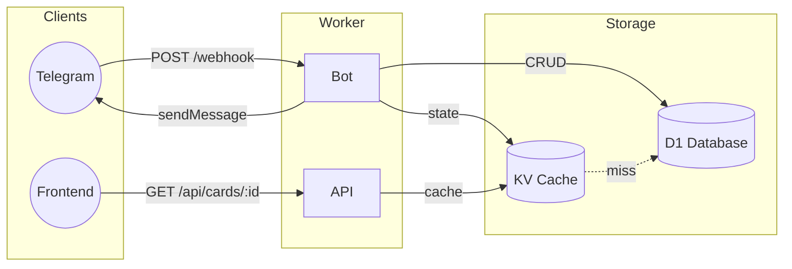

# Greeting Cards Backend

Telegram bot and REST API for managing digital greeting cards. Built with [Hono](https://hono.dev/) on [Cloudflare Workers](https://workers.cloudflare.com/).

## Overview



## Prerequisites

- [Node.js](https://nodejs.org/) v18+
- [pnpm](https://pnpm.io/)
- [Cloudflare account](https://dash.cloudflare.com/)

## Installation

1.  Install dependencies:

    ```sh
    pnpm install
    ```

2.  Generate types:

    ```sh
    pnpm run cf-typegen
    ```

## Configuration

### Environment Variables

Create a `.env` file from `.env.example` and set the following secrets:

| Variable                  | Description                                      |
| ------------------------- | ------------------------------------------------ |
| `TELEGRAM_BOT_TOKEN`      | Token from [@BotFather](https://t.me/BotFather). |
| `TELEGRAM_WEBHOOK_SECRET` | Secret for webhook verification.                 |
| `TELEGRAM_CHAT_ID`        | Allowed chat ID for interactions.                |

### Variables

Configured in `wrangler.jsonc`:

| Variable       | Description                                                      |
| -------------- | ---------------------------------------------------------------- |
| `FRONTEND_URL` | Frontend origin for CORS (e.g., `https://cards.phanuphats.com`). |

### Bindings

| Binding      | Type         | Description                          |
| ------------ | ------------ | ------------------------------------ |
| `CARD_DB`    | D1 Database  | Stores greeting card records.        |
| `CARD_CACHE` | KV Namespace | Caches cards and conversation state. |

**KV Key Patterns**

| Pattern                | TTL    | Description                           |
| ---------------------- | ------ | ------------------------------------- |
| `card:<id>`            | 1 hour | Cached card data.                     |
| `chat:<chat_id>:state` | 1 hour | Conversation state for Telegram chat. |

## Development

Start the local development server:

```sh
pnpm run dev
```

## Usage

### Bot Commands

| Command        | Description               |
| -------------- | ------------------------- |
| `/start`       | Welcome message.          |
| `/help`        | Show available commands.  |
| `/create`      | Start card creation flow. |
| `/list`        | List all active cards.    |
| `/view <id>`   | View a specific card.     |
| `/update <id>` | Update a card.            |
| `/delete <id>` | Soft-delete a card.       |
| `/cancel`      | Cancel current operation. |

### API Endpoints

| Method | Endpoint         | Description                |
| ------ | ---------------- | -------------------------- |
| `GET`  | `/`              | Health check and API info. |
| `GET`  | `/api/cards/:id` | Retrieve a card by ID.     |

## Deployment

Deploy to Cloudflare Workers:

```sh
pnpm run deploy
```

## License

[MIT](LICENSE)
