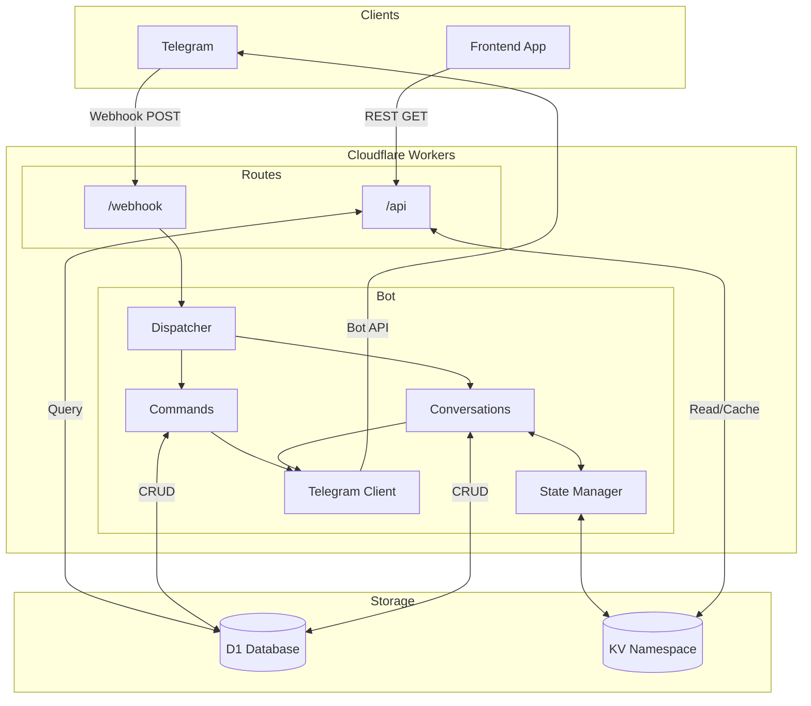
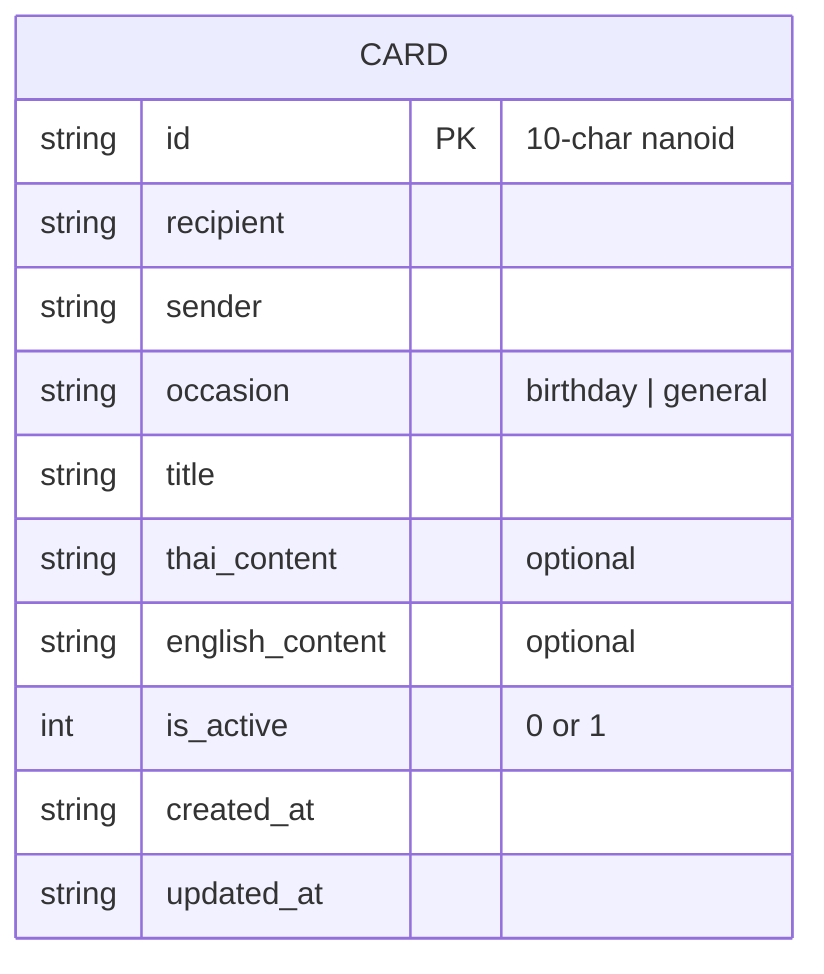

# Greeting Cards Backend

A Telegram bot and REST API for creating and managing digital greeting cards. Built with [Hono](https://hono.dev/) and deployed on [Cloudflare Workers](https://workers.cloudflare.com/).

## Architecture



## Environment Variables

| Variable | Description |
|----------|-------------|
| `TELEGRAM_BOT_TOKEN` | Bot token from [@BotFather](https://t.me/BotFather) |
| `TELEGRAM_WEBHOOK_SECRET` | Secret token for webhook verification |
| `TELEGRAM_CHAT_ID` | Allowed chat ID for bot interactions |
| `FRONTEND_URL` | Frontend origin for CORS (e.g., `https://cards.example.com`) |

## Bindings

| Binding | Type | Description |
|---------|------|-------------|
| `CARD_DB` | D1 Database | Stores greeting card records |
| `CARD_CACHE` | KV Namespace | Caches cards and conversation state |

### KV Key Patterns

| Pattern | TTL | Description |
|---------|-----|-------------|
| `card:<id>` | 1 hour | Cached card data |
| `chat:<chat_id>:state` | 1 hour | Conversation state for Telegram chat |

## Data Model



## Bot Commands

| Command | Description |
|---------|-------------|
| `/start` | Welcome message |
| `/help` | Show available commands |
| `/create` | Start card creation flow |
| `/list` | List all active cards |
| `/view <id>` | View a specific card |
| `/update <id>` | Update a card |
| `/delete <id>` | Soft-delete a card |
| `/cancel` | Cancel current operation |

## API Endpoints

| Method | Endpoint | Description |
|--------|----------|-------------|
| `GET` | `/` | Health check and API info |
| `GET` | `/api/cards/:id` | Retrieve a card by ID |

## Prerequisites

- [Node.js](https://nodejs.org/) v18+
- [pnpm](https://pnpm.io/)
- [Cloudflare account](https://dash.cloudflare.com/)

## Setup

1. **Install dependencies**

   ```sh
   pnpm install
   ```

2. **Configure environment**

   ```sh
   cp .env.example .env
   ```

   Edit `.env` with your values.

3. **Generate types**

   ```sh
   pnpm run cf-typegen
   ```

## Development

```sh
pnpm run dev
```

## Deployment

```sh
pnpm run deploy
```

## Scripts

| Script | Description |
|--------|-------------|
| `pnpm run dev` | Start local development server |
| `pnpm run deploy` | Deploy to Cloudflare Workers |
| `pnpm run lint` | Run Biome linter with auto-fix |
| `pnpm run cf-typegen` | Generate TypeScript types from wrangler config |

## License

[MIT](LICENSE)
